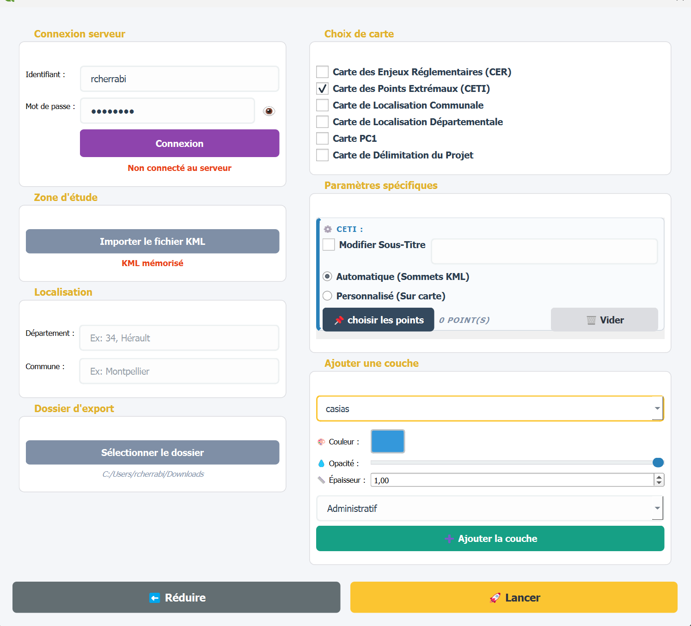

# Générateur-de-cartes# 🗺️ PyQGIS Print Automation — Générateur de Cartes Réglementaires

> **Extension PyQGIS de production et d'automatisation cartographique pour l'instruction de permis de construire (PC1), cartes d'enjeux réglementaires (CER) et dossiers fonciers.**

---

## 📌 Enjeux métiers & Contexte

Au sein du service cartographique, la confection manuelle de pièces graphiques constitue l'un des postes les plus chronophages. Chaque dossier d'avant-projet ou d'instruction administrative impose la livraison de documents visuels rigoureusement normés :
* **Prises de vue du projet dans son environnement (pièce PC1 du permis de construire)**[cite: 1] ;
* **Cartes des Enjeux Réglementaires (CER)** croisant les zonages environnementaux et les servitudes locales[cite: 1] ;
* **Cartes des points extrémaux (CETI)** pour figer les coordonnées géodésiques du périmètre foncier[cite: 1] ;
* **Cartes de délimitation foncière et de localisation (communale et départementale)** pour la concertation publique[cite: 1].

Auparavant, la configuration manuelle du composeur d'impression (chargement des couches, calage des échelles, placement des logos, orientation, légendes dynamiques) prenait entre **20 et 30 minutes par carte** et risquait d'engendrer des disparités graphiques[cite: 1]. 

**Le Générateur de Cartes** élimine cette tâche répétitive en pilotant l'API de mise en page de QGIS pour générer des livrables complets en **quelques secondes**, tout en garantissant le respect strict de la charte graphique d'entreprise[cite: 1].

---

## 🛠️ Compétences & Technologies mises en œuvre

* **Langages & Frameworks :** Python 3, PyQGIS (`QgsPrintLayout`, `QgsLayoutItemMap`, `QgsLayoutItemLegend`), PyQt5[cite: 1]
* **Automatisation SIG :** Moteurs de rendu QGIS, génération d'atlas dynamiques, injection automatique de fonds raster (IGN, Google Satellite)[cite: 1]
* **Bases de données spatiales :** Connexion directe et sécurisée à **PostgreSQL / PostGIS** avec filtrage par index `code_dep`[cite: 1]
* **Traitements géométriques :** Calcul d'emprises englobantes (*bounding boxes*), intersections administratives, extraction de sommets et calcul de vecteurs d'angles de vue[cite: 1]

---

## ⚙️ Fonctionnalités clés & Modules de l'outil

### 1. Adaptation dynamique du format et du cadrage
* 📐 **Dimensionnement adaptatif (A4, A3, A1) :** l'algorithme évalue l'emprise au sol du fichier KML importé et sélectionne automatiquement le format de papier et l'orientation les plus lisibles selon l'échelle cible choisie[cite: 1].
* 🟨 **Cadre réglementaire automatique :** tracé instantané d'une bordure calibrée à exactement 5 mm des marges de la page, quelle que soit la taille de papier retenue[cite: 1].

### 2. Détection administrative & Titrages dynamiques
* 📍 **Intersection spatiale automatique :** dès le chargement du polygone d'étude, le script intersecte le référentiel communal et départemental[cite: 1]. Si le site est à cheval sur plusieurs communes, elles sont automatiquement concaténées[cite: 1].
* 🏷️ **Habillage textuel automatisé :** génération dynamique du sous-titre officiel (*« Projet de parc photovoltaïque sur la commune de %nom_commune% »*) et insertion du cartouche normé[cite: 1].

### 3. Outils interactifs avancés pour cartes complexes
* 📷 **Module « Tracer les Vues PC » (Pièce PC1) :** outil interactif sur canevas permettant à l'opérateur de cliquer l'emplacement de l'observateur puis la cible du regard. Le script trace le cône de visibilité, ouvre une boîte contextuelle pour nommer la prise de vue (ex. *Vue 1*) et intègre l'étiquette dynamique sur le fond IGN[cite: 1].
* 📍 **Module Points Extrémaux (CETI) :** choix entre l'extraction automatique de l'ensemble des sommets de l'emprise ou la sélection manuelle point par point sur la carte, avec tableau des coordonnées géodésiques WGS84 / Lambert-93 généré directement dans la mise en page[cite: 1].
* 🎨 **Surcharge et gestion des couches :** ajout à la volée de couches de données PostGIS avec réglage personnalisé de l'épaisseur, de la couleur et de l'opacité via l'interface[cite: 1].

---

## 🖥️ Console de pilotage PyQt

L'interface sépare les étapes d'accès aux données (connexion AWS/PostgreSQL, import KML, choix du dossier) de la composition cartographique (choix du modèle, échelles, surcharges)[cite: 1] :

---

## 📄 Livrables cartographiques générés

| Carte des Enjeux Réglementaires (CER) | Pièce PC1 — Vues Photographiques |
| :---: | :---: |
| *Croisement automatisé des zonages environnementaux (ZNIEFF, Natura 2000, servitudes) et du relief[cite: 1].* | *Intégration du fond topographique IGN, cadrage et report automatique des axes de prise de vue[cite: 1].* |
|  |  |

| Carte de Localisation Communale | Carte de Délimitation du Projet |
| :---: | :---: |
| *Cadrage macroscopique sur les limites communales pour les phases de concertation locale[cite: 1].* | *Zoom foncier haute résolution sur fond satellite pour la sécurisation des baux[cite: 1].* |
|  |  |

---

## 📈 Valeur ajoutée mesurable

* ⏱️ **Gain de temps :** passage de 25 minutes de montage manuel à **moins de 10 secondes** par planche cartographique[cite: 1].
* 🎯 **Fiabilité & Conformité graphique :** suppression totale des erreurs de manipulation, respect strict de la charte visuelle d'entreprise (polices, logos, échelles normalisées)[cite: 1].
* 📂 **Désengorgement du pôle SIG :** autonomie accrue accordée aux chargés d'études pour la production des pièces de faisabilité[cite: 1].

---

## 👤 Auteur
**Reda Cherrabi**  
*Géomaticien & Développeur SIG*  
Projet développé dans le cadre du Master Géomatique & Aménagement du Territoire (Luxel)[cite: 1].
